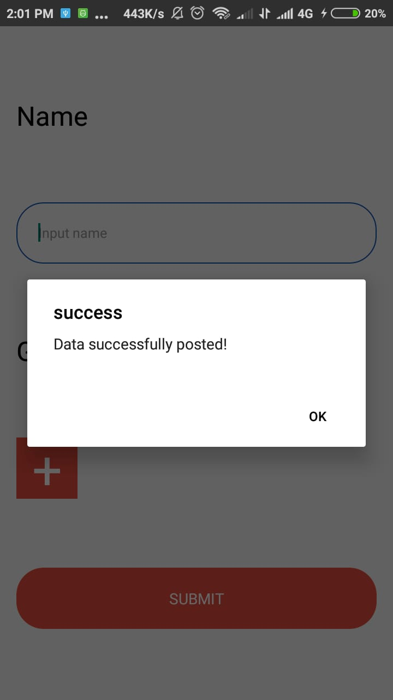

<h1 align="center">Exam - Hapid</h1>
  

    <image align="center" width="200" src='https://cdn4.iconfinder.com/data/icons/logos-3/600/React.js_logo-512.png' />
  

  Built with React Native.

## Introduction
<b>Exam - Hapid</b> is a android app built with React Native.

## Screenshots

     
     
     
     
     
    

## Release APK

## Contributors

  <table>
    <tr>
      <td align="center">
        <a href="https://github.com/AdmiralYuuShi">
          <b>Hapid Moch Jamil (Admiral YuuShi)</b>
        </a>
      </td>
    </tr>
  </table>

